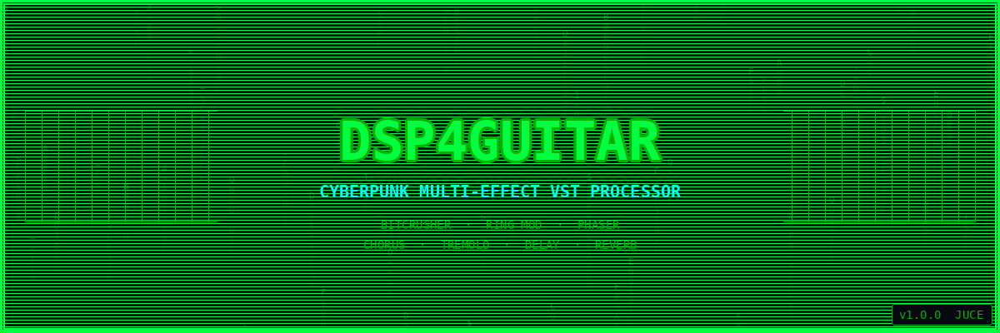
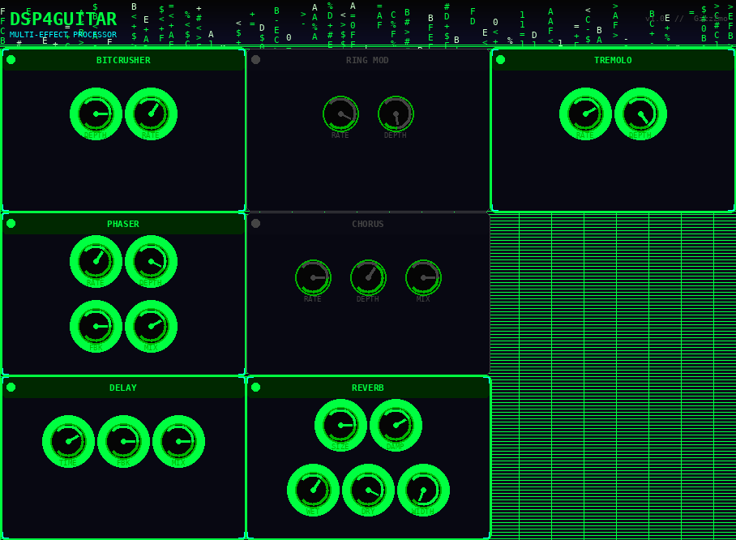
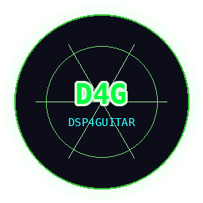

# DSP4Guitar — Cyberpunk Multi-Effect Processor

[](https://github.com/GizzZmo/DSP4Guitar/actions/workflows/ci.yml)

> *"Plug in. Drop out. Enter the Matrix."*



---

## Overview

A professional-grade, multi-effect **VST3/AU plugin** built with the **JUCE framework**, wrapped in a full **cyberpunk / Matrix-terminal aesthetic** — neon-green-on-black UI, scrolling Matrix-rain header animation, glowing LED toggles, and custom rotary knobs.

The plugin provides a **10-effect processing chain**, each independently bypassable, running in a fixed signal-flow order optimised for guitar. Parameters are DAW-automatable via JUCE's `AudioProcessorValueTreeState` and plugin state is persisted across sessions.

## UI Preview

| Plugin UI | Logo |
|-----------|------|
|  |  |

> The SVG vector mockup is at [`assets/screenshots/plugin_ui.svg`](assets/screenshots/plugin_ui.svg).

---

## Features

✅ **Cyberpunk / Matrix terminal UI** — neon green `#00FF41`, dark-panel aesthetic, scrolling rain animation  
✅ **10-effect signal chain** — each effect independently bypassable  
✅ **Bitcrusher** — bit-depth reduction and sample-rate downsampling for lo-fi tones  
✅ **Fuzz** — hard-clipping drive with tone shaping and output level  
✅ **3-Band Multiband Compressor** — independent crossover compression per band  
✅ **Ring Modulator** — LFO-driven amplitude modulation  
✅ **Auto Wah** — LFO-swept band-pass filter with resonance control  
✅ **Phaser** — all-pass stage phasing with feedback  
✅ **Chorus** — modulated delay chorus  
✅ **Tremolo** — LFO-controlled amplitude tremolo  
✅ **Delay** — feedback tape delay (up to 2 s)  
✅ **Reverb** — Schroeder-style room reverb  
✅ **Preset save/load** — full parameter state persisted via XML  
✅ **Real-time waveform visualisation**  

---

## Effect Chain

Effects are processed in the following fixed order. Each effect can be enabled or disabled independently with its toggle button.

| # | Effect | Key Controls |
|---|--------|-------------|
| 1 | **Bitcrusher** | Bit Depth (2–16 bits), Downsample rate (1–100×) |
| 2 | **Fuzz** | Drive (1–100), Tone, Level (dB), Mix |
| 3 | **Multiband Compressor** | Per-band threshold (Low/Mid/High), Ratio, Attack, Release, Makeup gain |
| 4 | **Ring Modulator** | LFO Rate (20–5 000 Hz), Depth |
| 5 | **Auto Wah** | LFO Rate, Sweep Depth, Centre Frequency (300–3 000 Hz), Resonance, Mix |
| 6 | **Phaser** | Rate, Depth, Feedback, Mix |
| 7 | **Chorus** | Rate, Depth, Mix |
| 8 | **Tremolo** | Rate, Depth |
| 9 | **Delay** | Time (1–2 000 ms), Feedback, Mix |
| 10 | **Reverb** | Room Size, Damping, Wet Level, Dry Level, Width |

See [`Documentation/effects-reference.md`](Documentation/effects-reference.md) for the full parameter reference, including ranges and default values.

---

## Cyberpunk Colour Palette

| Token | Hex | Usage |
|-------|-----|-------|
| Matrix Green | `#00FF41` | Active knobs, borders, LEDs |
| Dark Green | `#00B300` | Track fills, secondary labels |
| Near-Black | `#050505` | Knob backgrounds |
| Dark BG | `#0D0D1A` | Window background |
| Cyan | `#00FFFF` | Accent labels, corner brackets |
| Gray | `#444444` | Inactive / disabled elements |

---

## Installation

### Prerequisites

| Tool | Version |
|------|---------|
| CMake | ≥ 3.15 |
| C++ compiler | C++17 (MSVC 2019+, Clang 10+, GCC 9+) |
| JUCE | 7.0.9 (downloaded automatically by CMake/CI) |

**Linux only** — install audio dev packages:
```sh
sudo apt-get install libasound2-dev libjack-jackd2-dev libcurl4-openssl-dev \
  libfreetype6-dev libx11-dev libxcomposite-dev libxcursor-dev \
  libxinerama-dev libxrandr-dev libxrender-dev libglu1-mesa-dev mesa-common-dev
```

**macOS only** — install Xcode Command Line Tools:
```sh
xcode-select --install
```

### Build from Source

```sh
# 1. Clone the repository
git clone https://github.com/GizzZmo/DSP4Guitar.git
cd DSP4Guitar

# 2. Download JUCE framework
git clone --depth 1 --branch 7.0.9 https://github.com/juce-framework/JUCE.git

# 3. Configure and build (Release)
cmake -B build -DCMAKE_BUILD_TYPE=Release
cmake --build build --config Release
```

### Install the Plugin

Copy the built file to your DAW's plugin folder:

| Platform | VST3 path | AU path |
|----------|-----------|---------|
| Linux | `~/.vst3/` | — |
| macOS | `/Library/Audio/Plug-Ins/VST3/` | `/Library/Audio/Plug-Ins/Components/` |
| Windows | `C:\Program Files\Common Files\VST3\` | — |

Then open your DAW, rescan plugins, and load **DSP4Guitar**.

### Download Pre-built Binaries

Pre-built VST3/AU binaries are attached to each [GitHub Release](https://github.com/GizzZmo/DSP4Guitar/releases) and to every successful CI run (Actions tab → run → Artifacts).

---

## How to Use

1. Load the plugin on a guitar track (or any mono/stereo audio source).
2. Enable the effects you want using the toggle buttons.
3. Adjust parameters with the rotary knobs and sliders.
4. Save your settings as a preset for instant recall.
5. Use MIDI program-change messages to switch presets hands-free.
6. Monitor the processed signal with the real-time waveform display.

---

## Development

### Architecture

```
MultiEffectProcessor (AudioProcessor)
├── EffectChain (juce::dsp::ProcessorChain)
│   ├── Bitcrusher
│   ├── Fuzz
│   ├── MultibandCompressor
│   ├── RingModulator
│   ├── WahWah
│   ├── juce::dsp::Phaser
│   ├── juce::dsp::Chorus
│   ├── Tremolo
│   ├── juce::dsp::DelayLine  (manual feedback loop in processBlock)
│   └── juce::dsp::Reverb
└── AudioProcessorValueTreeState (APVTS)
    └── All parameters (bypassable per-effect + per-effect controls)

MultiEffectProcessorEditor (AudioProcessorEditor)
├── CyberpunkLookAndFeel  (custom JUCE LookAndFeel)
├── PresetManager
└── Per-effect panels (knobs, toggles, labels)
```

### Source Files

| File | Purpose |
|------|---------|
| `MultiEffectProcessor.h/.cpp` | Plugin entry point, DSP classes, effect chain |
| `PluginEditor.h/.cpp` | GUI — panels, knobs, waveform display |
| `CyberpunkLookAndFeel.h` | Custom JUCE LookAndFeel (cyberpunk theme) |
| `PresetManager.h/.cpp` | Save/load presets to/from XML |
| `Delay.h/.cpp` | Legacy delay helper (superseded by DelayLine in chain) |
| `Distortion.h/.cpp` | Legacy distortion helper |
| `Modulation.h/.cpp` | Legacy modulation helper |
| `StereoWidening.h/.cpp` | Stereo widening utility |
| `DSP4GuitarApp.h` | Standalone app wrapper |

### CI/CD

The project uses GitHub Actions for automated multi-platform builds, code quality checks, and release packaging:

- 📖 [CI Quick Start](.github/CI_QUICKSTART.md) — get up and running in minutes
- 📖 [CI Documentation](.github/CI_DOCUMENTATION.md) — full workflow reference
- 🔍 Run `./scripts/pre-commit-check.sh` (Linux/macOS) or `.\scripts\pre-commit-check.ps1` (Windows) to validate locally before pushing

### Contributing

See [CONTRIBUTING.md](CONTRIBUTING.md) for code standards, build instructions, and pull request guidelines.

---

## Documentation

| Document | Description |
|----------|-------------|
| [Documentation/effects-reference.md](Documentation/effects-reference.md) | Full parameter reference for all 10 effects |
| [Documentation/readme.md](Documentation/readme.md) | DSP theory compendium — distortion, dynamics, filters, modulation |
| [Documentation/vstplugin.md](Documentation/vstplugin.md) | VST plugin architecture and integration guide |
| [Documentation/performance.md](Documentation/performance.md) | Real-time performance and multi-channel processing |
| [Documentation/interactivemidi.md](Documentation/interactivemidi.md) | Waveform display and MIDI control integration |
| [.github/CI_DOCUMENTATION.md](.github/CI_DOCUMENTATION.md) | CI/CD workflow reference |

---

## License

MIT License — open-source for personal and commercial use. See [LICENSE](LICENSE).

